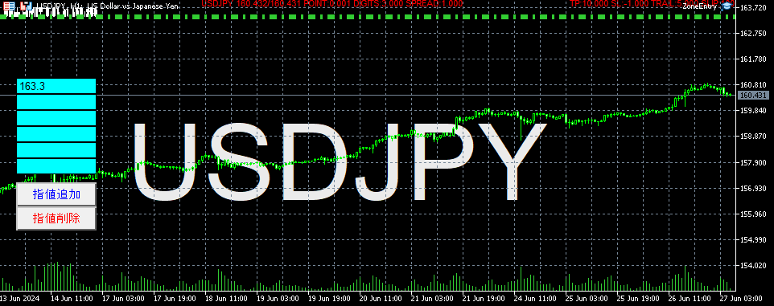

# ZoneEntry

MT5用の撒き餌EAです。

趣味で書いてみたら楽しくなってしまったので、更新していますが動作も含めて「きまぐれ」です。

## 説明
- BOXに指定した価格を入れて、指値追加ボタンで指値が自動でリクエストされます。
- 指定した価格から１時間のATRの値を加算したゾーンで撒き餌をします。
- 本数はMaxOrdersで指定された数量です。
- 残念ながらTPやSLの計算はバグっていると思われます。
- 複数約定した場合、有利なポジションを１つだけ残して、他は3pipsの利益になるようにTPがセットされます。
- 改良をしてプルリクエストをもらえると嬉しいかもしえれませんが、興味を失っていたら申し訳ないです。

## 免責
- 投資は自己責任です。
- いかなる条件であっても本EAを使って損失を被った場合でも一切責任を負いません。
- 使い方等の説明は一切応じません。

## ビルドに必要なライブラリ
https://github.com/junmt/MT5Libs

わからない人はビルド済みのリリースパッケージでお楽しみください。

## LICENSE
MIT License